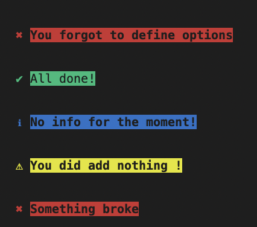

#cli-alert made with node js
### based on Ahmad Awais tutorial



## Install

```sh
npm install cli-alerts
```

## Usage

```js

const alert = require('cli-alerts')
```

//Provide the type, msg and name of the options

alert({type: 'success', msg: 'All done!'});

alert({type: 'info', msg: 'No info for the moment!'});

alert({type: 'warning', msg: 'You did add nothing !'});

alert({type: 'error', msg: 'Something broke'});

<br>

## API

### alert(options)

#### > options

Type: object <br>

Default: {}

You can specify the options below

#### > Type

Type: string <br>

Default: error

#### > msg

Type: string <br>

Default: You forgot to define options

You forgot to define options

#### > name

Type: string <br>

Default : '' (Empty String)


